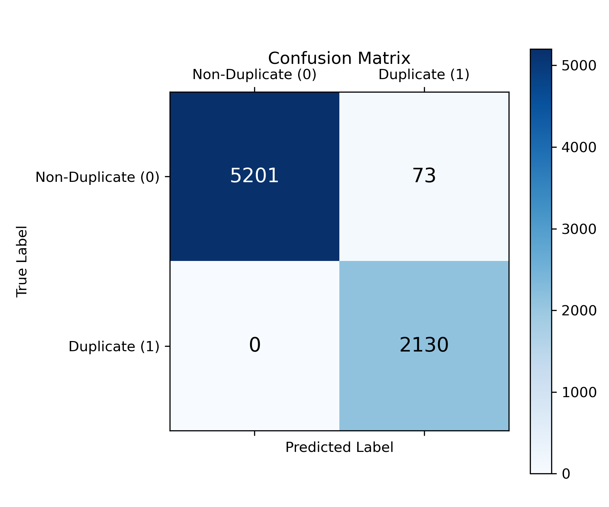
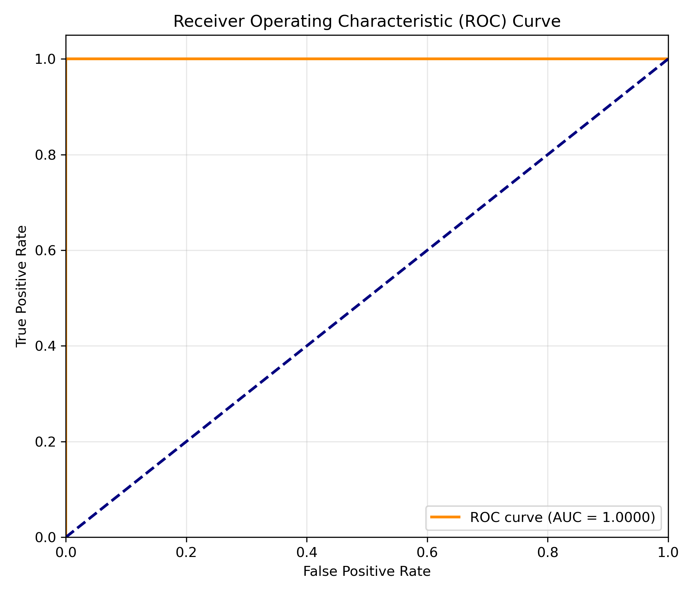
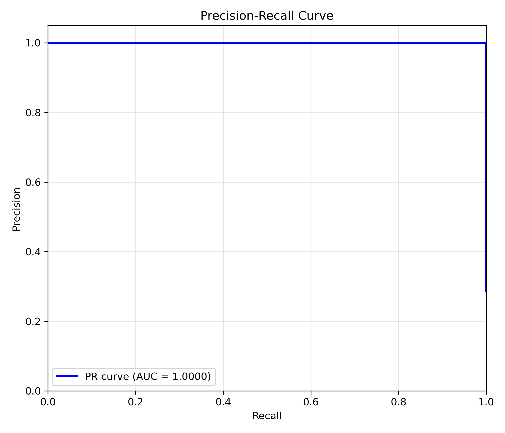
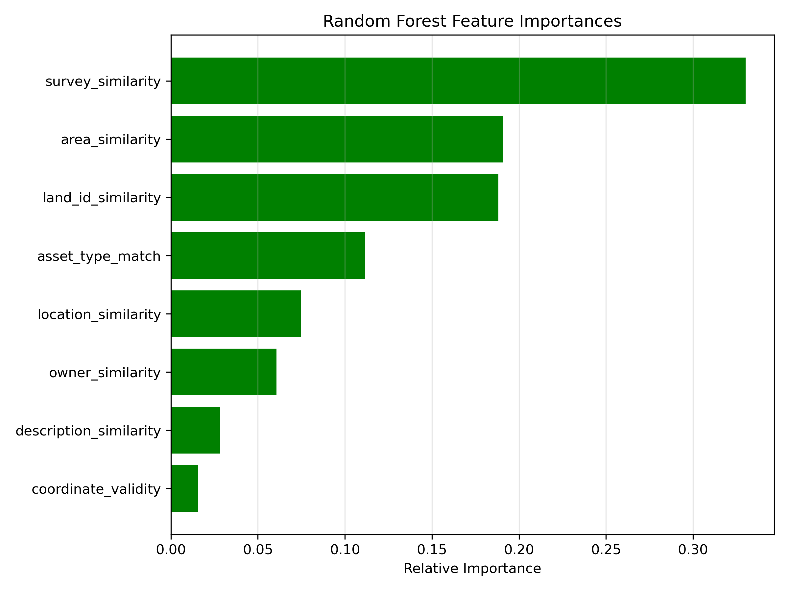
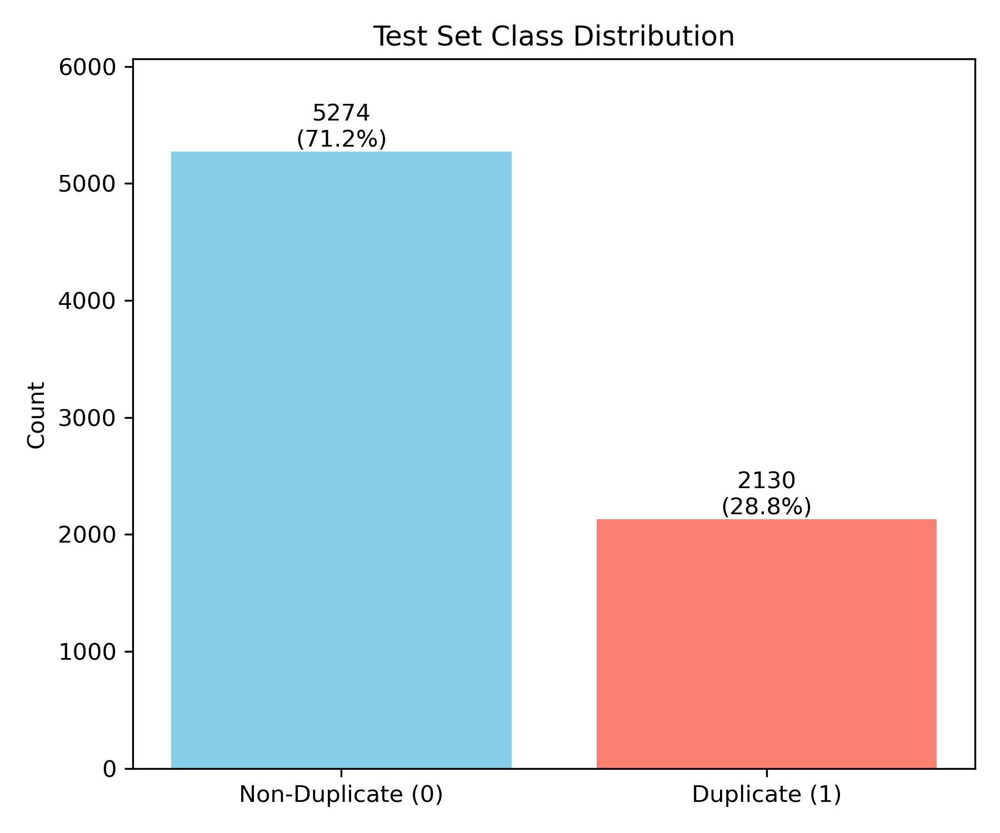
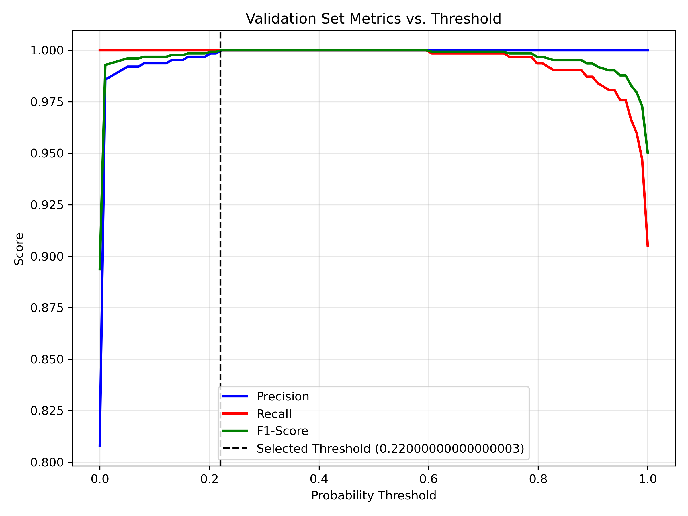
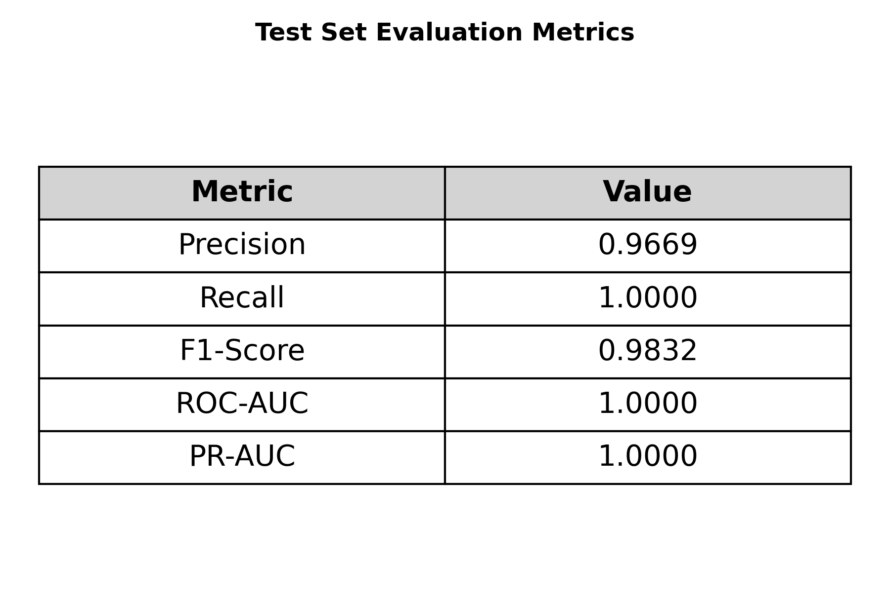

# FINAL Model Evaluation Report (Robustness Pipeline)

## Dataset Summary
- **Total Records:** 11874
- **Total Pairs:** 10748
- **Train Pairs:** 2574
- **Val Pairs:** 770
- **Test Pairs:** 7404

## Class Distribution
- **Train:** {1: 1996, 0: 578}
- **Val:** {1: 622, 0: 148}
- **Test:** {0: 5274, 1: 2130}

## Evaluation Metrics (Untouched Test Set)
- **Optimal Probability Threshold:** `0.22` (selected via validation set)
- **Precision:** `0.9669`
- **Recall:** `1.0000`
- **F1-Score:** `0.9832`
- **ROC-AUC:** `1.0000`
- **PR-AUC:** `1.0000`

## Confusion Matrix
| | Predicted Negative (0) | Predicted Positive (1) |
|---|---|---|
| **Actual Negative (0)** | 5201 | 73 |
| **Actual Positive (1)** | 0 | 2130 |

## Feature Importances
- **survey_similarity**: `0.3301`
- **area_similarity**: `0.1907`
- **land_id_similarity**: `0.1882`
- **asset_type_match**: `0.1116`
- **location_similarity**: `0.0748`
- **owner_similarity**: `0.0608`
- **description_similarity**: `0.0283`
- **coordinate_validity**: `0.0156`

## Evaluation Visualizations

*Note: The following graphs were generated from the actual final Random Forest model. The evaluation strictly uses the leakage-safe test set. The optimal threshold of 0.22 was selected using validation data only; the test data was not used for threshold selection.*

### 1. Confusion Matrix

Demonstrates the true negatives, false positives, false negatives, and true positives using the actual test predictions and actual labels.

### 2. ROC Curve

Shows the Receiver Operating Characteristic curve and the ROC-AUC score based on the actual model probability scores and test labels.

### 3. Precision-Recall Curve

Displays the trade-off between precision and recall at different thresholds, alongside the overall PR-AUC score.

### 4. Feature Importance

Visualizes the relative importance of all actual features used by the final Random Forest model.

### 5. Test Class Distribution

Shows the distribution of Duplicate (1) and Non-Duplicate (0) records in the final untouched test set.

### 6. Threshold Analysis

Illustrates how Precision, Recall, and F1-Score vary across different probability thresholds (0.0 to 1.0) on the **Validation Set**. The selected threshold of 0.22 is marked to visually demonstrate why it was chosen.

### 7. Metrics Summary

A summary table of the final test metrics (Precision, Recall, F1, ROC-AUC, PR-AUC) derived programmatically from actual predictions.
